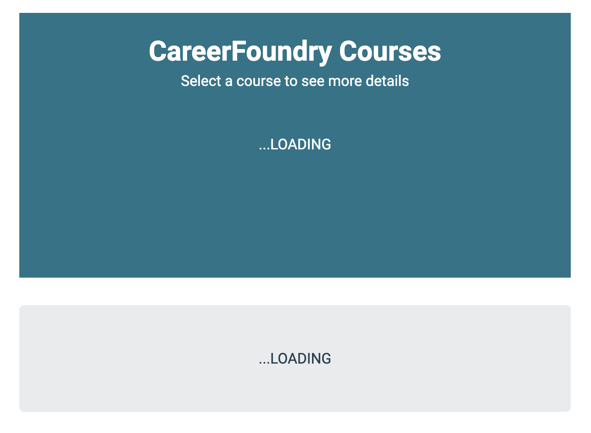
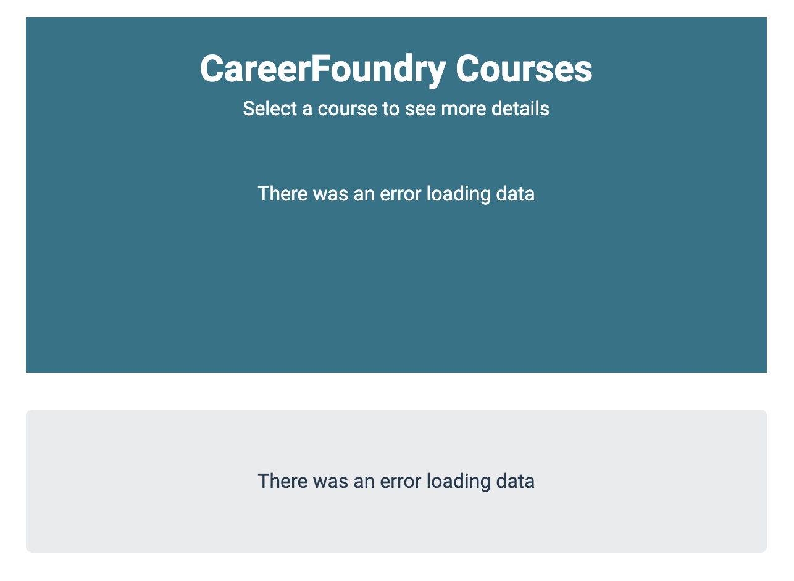

# CareerFoundry Frontend Developer Challenge 🤖

This repo contains the app requested as part of CareerFoundry's frontend developer challenge.

<p align="center">
  
</p>

## Install dependencies

```
npm i
```

## Run the app in development mode

```
npm start
```

## Run tests

```
npm test
```

## Requirements met

- ✅ CareerFoundry courses are fetched and displayed for users to select from.
- ✅ Users are able to select a course they are interested in.
- ✅ Based on users's course selection, the corresponding course details are fetched and displayed.
- ✅ The course details includes:
  - Course price in the correct currency based on the user's geolocation( USD is used for any country outside the EU).
  - Next course start date.
  - Following future start dates.
- ✅ Messages should be sent/received through our SocketClient.

## Potential improvements

- Request caching: currently a request is made every time a course is selected even though the data didn't change. We can leverage a library such as [react-query](https://react-query-v3.tanstack.com/) or [SWR](https://swr.vercel.app/) to automatically cache these requests and invalidate them when necessary.
- More test coverage

## Screenshots for loading and error states

### Loading



### Error


